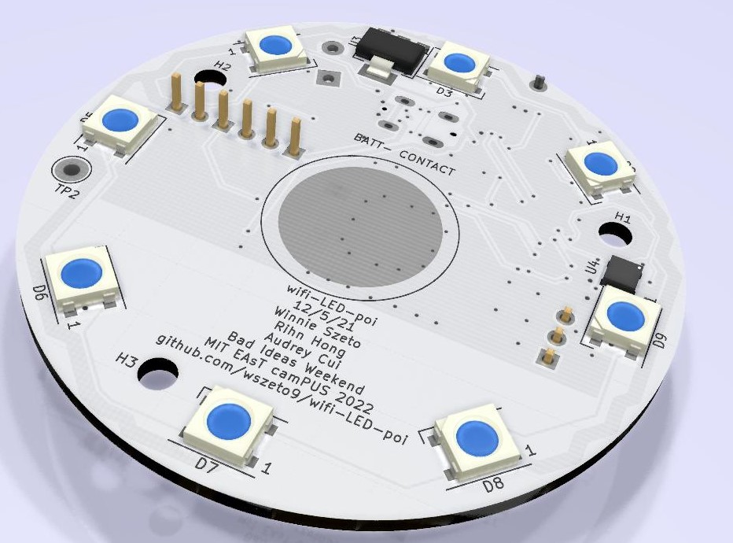

# WiFi-LED-Poi
USB-C Rechargable, WiFi Capable Glow Poi

<h2> Features:</h2>
<ul>
<li>ESP-12 MCU capable of WiFi-communication and syncronization of lights with music</li>
<li>Rechargable battery with a battery life of 3.5-5 hours</li>
<li>Programmable over USB-C</li>
<li>Charging over USB-C</li>
</ul>

