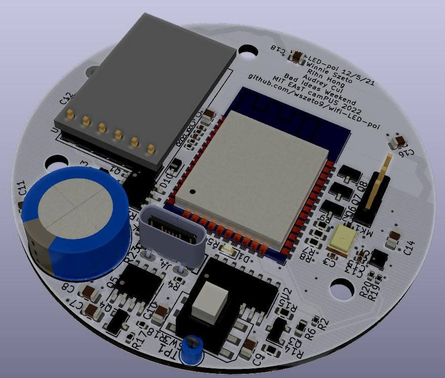

# WiFi-LED-Poi
USB-C Rechargable, WiFi Capable Glow Poi

<h2> Features:</h2>
<ul>
<li>ESP-32 MCU capable of WiFi-communication and syncronization of lights with music</li>
<li>Rechargable battery with a battery life of 3.5-5 hours</li>
<li>Programmable over USB-C</li>
<li>Charging over USB-C</li>
<li>analog RGB strip support</li>
<li>0.47F Supercapacitor capable of nefarious discharge acts</li>
<li>Onboard accelerometer and microphone</li>
</ul>

PCB Bottom

PCB Top

Glow Poi assembled with shell and battery
